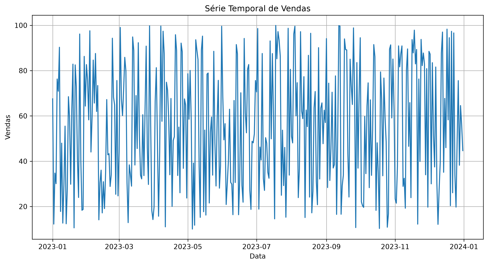
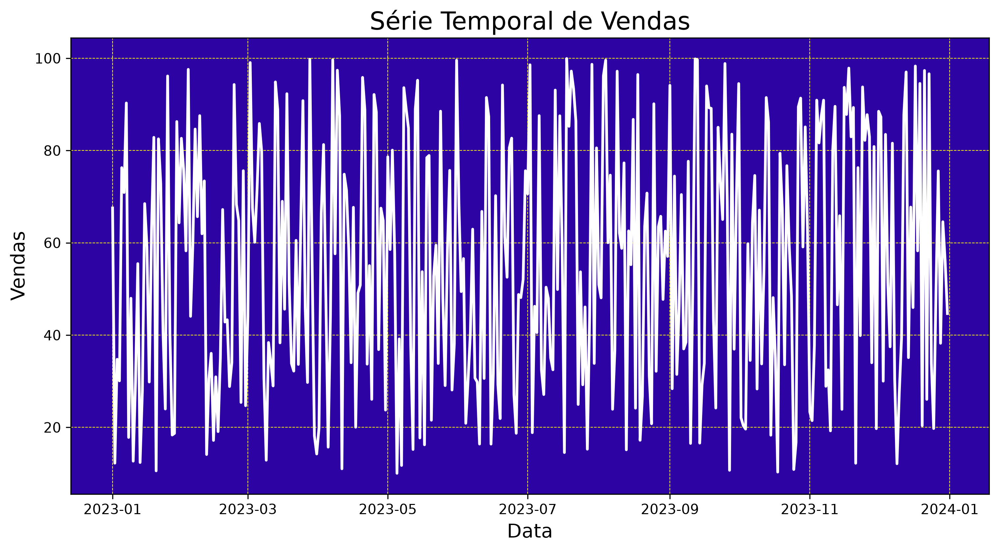
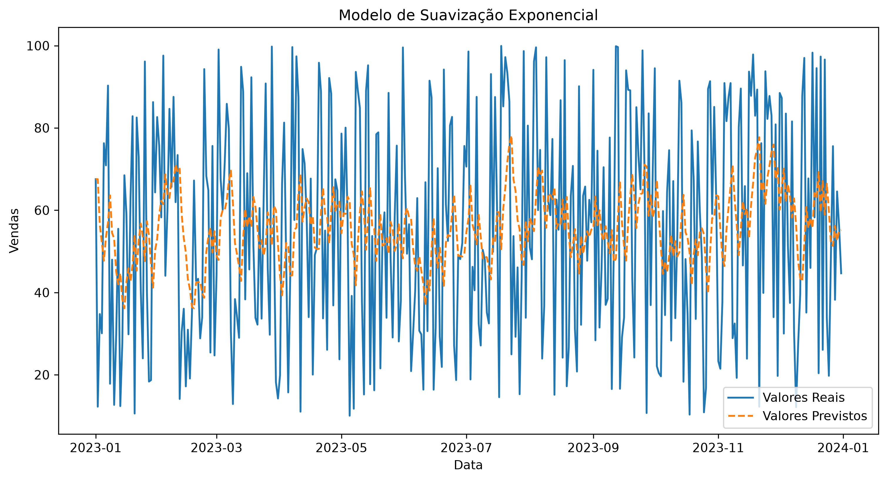

# Previsão de Vendas com Séries Temporais utilizando Suavização Exponencial Simples

## Introdução

Este projeto aplica técnicas de análise de séries temporais para avaliar dados históricos de vendas referentes ao ano de 2023 e gerar uma previsão para o período subsequente (01/01/2024).

O modelo foi desenvolvido utilizando o método de Suavização Exponencial Simples (*Simple Exponential Smoothing - SES*), implementado na biblioteca Statsmodels.

O objetivo é identificar padrões históricos nas vendas e estimar o valor esperado para o próximo período com base no comportamento observado da série temporal.

---

## Objetivos

* Realizar a análise exploratória dos dados de vendas;
* Visualizar o comportamento da série temporal;
* Aplicar o método de Suavização Exponencial Simples (SES);
* Ajustar o modelo aos dados históricos;
* Gerar uma previsão para janeiro de 2024;
* Avaliar visualmente o desempenho do modelo.

---

## Tecnologias e Bibliotecas Utilizadas

* Python
* NumPy
* Pandas
* Matplotlib
* Seaborn
* Statsmodels
* Jupyter Notebook

---

## Estrutura dos Dados

O conjunto de dados contém duas variáveis:

| Coluna       | Descrição                        |
| ------------ | -------------------------------- |
| Data         | Data da observação               |
| Total_Vendas | Valor total de vendas do período |

Exemplo:

| Data       | Total_Vendas |
| ---------- | ------------ |
| 2023-01-01 | 45           |
| 2023-02-01 | 52           |
| 2023-03-01 | 48           |

---

## Metodologia

O projeto foi desenvolvido seguindo as seguintes etapas:

1. Carregamento dos dados.
2. Conversão da coluna de datas para o formato temporal.
3. Definição da série temporal.
4. Análise exploratória dos dados.
5. Visualização gráfica das vendas.
6. Ajuste do modelo de Suavização Exponencial Simples (SES).
7. Comparação entre valores observados e ajustados.
8. Geração da previsão para janeiro de 2024.

---

## Série Temporal de Vendas

A figura abaixo apresenta a evolução das vendas ao longo do ano de 2023.

A análise visual da série temporal permite identificar oscilações, tendências e padrões que servirão de base para o modelo preditivo.



---

## Visualização Estilizada da Série Temporal

Como complemento à análise exploratória, foi criada uma visualização personalizada da série temporal com alto contraste para facilitar a inspeção visual dos dados.



---

## Modelo de Suavização Exponencial Simples

Após o treinamento do modelo SES, foi realizada a comparação entre os valores observados e os valores ajustados pelo modelo.

A proximidade entre as curvas indica a capacidade do modelo em representar adequadamente o comportamento histórico das vendas.



---

## Componentes de uma Série Temporal

Uma série temporal pode ser interpretada a partir de quatro componentes principais:

* Tendência (*Trend*);
* Sazonalidade (*Seasonality*);
* Ciclos (*Cycles*);
* Ruído (*Noise*).

A identificação desses componentes auxilia na compreensão do comportamento dos dados e na escolha do modelo de previsão mais adequado.

---

## Previsão para Janeiro de 2024

Após o ajuste do modelo de Suavização Exponencial Simples (SES), foi realizada uma previsão de um passo à frente (*one-step forecast*), estimando o valor esperado de vendas para janeiro de 2024.

### Geração da Previsão

```python
# Fazer previsões
num_previsoes = 1

previsoes = modelo_ajustado.forecast(
    steps=num_previsoes
)
```

### Exibição do Resultado

```python
print(
    'Previsão do Total de Vendas para Janeiro/2024:',
    round(previsoes.values[0], 4)
)
```

### Resultado Obtido

```text
Previsão do Total de Vendas para Janeiro/2024: 53.0879
```

O modelo estimou um total de vendas de **53,0879** unidades para janeiro de 2024 com base no histórico observado durante o ano de 2023.

---

## Limitações

* O conjunto de dados contém apenas informações referentes ao ano de 2023.
* O modelo SES é mais adequado para séries sem tendência ou sazonalidade pronunciadas.
* A utilização de mais períodos históricos pode aumentar a robustez das previsões.
* Modelos mais avançados, como Holt e Holt-Winters, podem ser avaliados em trabalhos futuros.

---

## Instalação das Dependências

```bash
pip install -r requirements.txt
```

Conteúdo sugerido para o arquivo `requirements.txt`:

```text
numpy
pandas
matplotlib
seaborn
statsmodels
jupyter
```

---

## Estrutura do Projeto

```text
Projeto_Previsao_Vendas/
│
├── previsao_vendas.ipynb
├── vendas_2023.csv
├── README.md
├── requirements.txt
│
└── imagens/
    ├── serie_temporal_vendas.png
    ├── serie_temporal_estilizada.png
    └── modelo_suavizacao_exponencial.png
```

---

## Conclusão

Os resultados demonstram a aplicação prática da técnica de Suavização Exponencial Simples para previsão de séries temporais de vendas.

O modelo foi capaz de capturar o comportamento histórico dos dados e gerar uma estimativa para o período subsequente. Embora o conjunto de dados seja reduzido e contenha apenas informações referentes ao ano de 2023, o projeto ilustra de forma clara as etapas fundamentais de preparação dos dados, análise exploratória, modelagem e previsão utilizando Python.

---

# Sales Forecasting Using Simple Exponential Smoothing

## Description

This project applies time series analysis techniques to evaluate historical sales data from 2023 and generate a forecast for the subsequent period (01/01/2024).

The forecasting model was developed using the Simple Exponential Smoothing (SES) method available in the Statsmodels library.

The objective is to identify historical sales patterns and estimate the expected value for the next period.

---

## Libraries Used

* Python
* NumPy
* Pandas
* Matplotlib
* Seaborn
* Statsmodels
* Jupyter Notebook

---

## Forecast for January 2024

After fitting the Simple Exponential Smoothing (SES) model, a one-step-ahead forecast was generated to estimate sales for January 2024.

### Forecast Generation

```python
num_previsoes = 1

previsoes = modelo_ajustado.forecast(
    steps=num_previsoes
)
```

### Displaying the Result

```python
print(
    'Sales Forecast for January/2024:',
    round(previsoes.values[0], 4)
)
```

### Forecast Output

```text
Sales Forecast for January/2024: 53.0879
```

The model estimated total sales of **53.0879** units for January 2024 based on the historical sales behavior observed throughout 2023.

---

## Conclusion

This project demonstrates the practical application of Simple Exponential Smoothing for sales forecasting using time series data.

The model successfully captured the historical behavior of the dataset and generated a forecast for the following period, illustrating the fundamental stages of data preparation, exploratory analysis, modeling, and forecasting in Python.

---

## Author

Project developed for Data Science and Time Series Analysis studies using Python.
